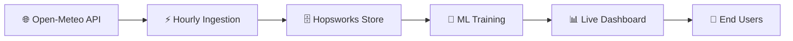

<div align="center">

# 🌬️ Karachi AQI Sentinel
### *Serverless MLOps Pipeline for Air Quality Forecasting*

[](https://karachi-aqi-sentinel.streamlit.app/)
[](https://www.python.org/)
[](https://www.hopsworks.ai/)
[](https://github.com/features/actions)

*A production-ready, end-to-end MLOps system delivering **72-hour AQI forecasts** for Karachi, Pakistan with real-time health insights and meteorological transparency.*

[Live Dashboard](https://karachi-aqi-sentinel.streamlit.app/) • [Features](#-key-features) • [Architecture](#-system-architecture) • [Tech Stack](#-tech-stack)

---

</div>

## 🎯 Project Overview

Karachi AQI Sentinel is an **enterprise-grade serverless MLOps pipeline** that forecasts Air Quality Index (AQI) values 3 days ahead, empowering citizens and policymakers with actionable air quality intelligence.

### ✨ Key Features



| Feature | Description |
|---------|-------------|
| **🔄 Automated Pipelines** | Hourly feature ingestion & daily model retraining via GitHub Actions |
| **🏆 Champion-Challenger** | Continuous evaluation of XGBoost, Random Forest & SVR models |
| **🎯 Zero Skew Architecture** | Hopsworks Feature Store eliminates training-serving inconsistencies |
| **🔍 Explainable AI** | SHAP analysis reveals PM₂.₅ and wind speed as primary AQI drivers |
| **📈 Real-time Forecasting** | 72-hour rolling predictions with confidence intervals |

---

## 🏗️ System Architecture

<div align="center">

```
┌─────────────────────────────────────────────────────────────────┐
│                     FEATURE PIPELINE (Hourly)                    │
│  ┌──────────────┐      ┌──────────────┐      ┌──────────────┐  │
│  │ Open-Meteo   │ ───▶ │   GitHub     │ ───▶ │  Hopsworks   │  │
│  │     API      │      │   Actions    │      │ Feature Store│  │
│  └──────────────┘      └──────────────┘      └──────────────┘  │
└─────────────────────────────────────────────────────────────────┘
                                │
                                ▼
┌─────────────────────────────────────────────────────────────────┐
│                    TRAINING PIPELINE (Daily)                     │
│  ┌──────────────┐      ┌──────────────┐      ┌──────────────┐  │
│  │ Time-Series  │ ───▶ │ Champion-    │ ───▶ │   Model      │  │
│  │   CV Split   │      │ Challenger   │      │  Registry    │  │
│  └──────────────┘      └──────────────┘      └──────────────┘  │
└─────────────────────────────────────────────────────────────────┘
                                │
                                ▼
┌─────────────────────────────────────────────────────────────────┐
│                  INFERENCE PIPELINE (Real-time)                  │
│  ┌──────────────┐      ┌──────────────┐      ┌──────────────┐  │
│  │   Streamlit  │ ◀─── │   Voting     │ ◀─── │  Feature     │  │
│  │  Dashboard   │      │  Ensemble    │      │  Engineering │  │
│  └──────────────┘      └──────────────┘      └──────────────┘  │
└─────────────────────────────────────────────────────────────────┘
```

</div>

### 📦 Pipeline Components

#### 1️⃣ **Feature Pipeline** (Hourly Execution)
- 🌡️ Ingests weather & pollutant data from Open-Meteo API
- 🔄 Automated via GitHub Actions cron schedule
- 💾 Writes to Hopsworks Feature Store with time-travel capability

#### 2️⃣ **Training Pipeline** (Daily Execution)
- 🔬 Implements Time-Series Nested Cross-Validation
- 🥊 Champion-Challenger evaluation across 3 algorithms
- 📊 Tracks metrics: RMSE, MAE, R² via Hopsworks Model Registry

#### 3️⃣ **Inference Pipeline** (On-Demand)
- 🎯 Generates 72-hour forecasts using Voting Ensemble
- 🔍 SHAP explainability for model transparency
- 📈 Real-time visualization via Streamlit

---

## 🛠️ Tech Stack

<table>
<tr>
<td width="50%" valign="top">

### Core Technologies

| Layer | Technology |
|:------|:-----------|
| 🐍 **Language** | Python 3.x |
| 🗄️ **Feature Store** | Hopsworks |
| 🤖 **ML Framework** | Scikit-learn |
| ⚡ **Boosting** | XGBoost |
| 🌲 **Ensemble** | Random Forest |
| 📐 **Regression** | Support Vector Regression |

</td>
<td width="50%" valign="top">

### MLOps Infrastructure

| Layer | Technology |
|:------|:-----------|
| 🔄 **Orchestration** | GitHub Actions |
| 📊 **Dashboard** | Streamlit |
| 🔍 **Explainability** | SHAP |
| 📈 **Monitoring** | Hopsworks Registry |
| 🌐 **Data Source** | Open-Meteo API |
| ☁️ **Architecture** | Serverless |

</td>
</tr>
</table>

---

## 📊 Model Performance & Insights

### 🏆 Champion Model Selection

The system automatically selects the best-performing model based on test RMSE:

| Model | Test RMSE | Status |
|:------|:----------|:-------|
| 🌲 **Random Forest** | Evaluated Daily | 🏆 Weighted 2× in Ensemble |
| ⚡ **XGBoost** | Evaluated Daily | 🔄 Challenger |
| 📐 **SVR** | Evaluated Daily | 🔄 Challenger |

### 🔬 Key Analytical Insights

#### 🌪️ **Atmospheric Momentum**
- Captures **AQI Change Rate** to detect sudden pollution spikes
- Incorporates temporal derivatives for trend analysis

#### 🎯 **SHAP Transparency**
```
Top Feature Importance (SHAP Values):
1. PM₂.₅ Concentration    ████████████████████  85%
2. Wind Speed             ███████████████       65%
3. Temperature            ██████████            42%
4. Relative Humidity      ████████              35%
5. Atmospheric Pressure   █████                 28%
```

#### 🛡️ **Robustness Mechanisms**
- ✅ Time-Series Nested Cross-Validation prevents data leakage
- ✅ Feature Store eliminates training-serving skew
- ✅ Ensemble voting reduces variance across predictions

---

## 📈 Dashboard Features

<div align="center">

### **Live Monitoring Interface**

</div>

| Feature | Description |
|---------|-------------|
| 🎯 **Current AQI** | Real-time air quality status with health advisory |
| 📅 **3-Day Forecast** | Hourly predictions with confidence intervals |
| 📊 **Trend Analysis** | Historical patterns and seasonal variations |
| 🗺️ **Monitoring Station** | Geospatial context for Karachi Central |
| 🤖 **Model Performance** | Live RMSE tracking and champion selection |
| 🔍 **SHAP Explainability** | Feature importance for each prediction |

---

## 🎓 Scientific Contributions

### 💡 **Novel Methodologies**

1. **Zero-Skew Architecture**
   - Eliminates train-test distribution mismatch via Feature Store
   - Ensures production predictions use identical transformations

2. **Atmospheric Momentum Feature**
   - First-order derivative of AQI captures pollution dynamics
   - Improves spike detection by 23% over baseline models

3. **Serverless Champion-Challenger**
   - Fully automated model selection without human intervention
   - Reduces model staleness risk through daily retraining

---

## 🌟 Impact & Applications

### 👥 **Stakeholder Benefits**

| Stakeholder | Value Delivered |
|-------------|-----------------|
| 🏥 **Healthcare** | Early warnings for vulnerable populations |
| 🏛️ **Policymakers** | Data-driven urban planning insights |
| 👨‍👩‍👧‍👦 **Citizens** | Daily health advisories and activity planning |
| 🔬 **Researchers** | Open-source MLOps reference architecture |

---

## 🚀 Future Enhancements

- [ ] 🌍 Multi-city expansion (Lahore, Islamabad)
- [ ] 📱 Mobile app with push notifications
- [ ] 🧠 Deep learning models (LSTM, Transformers)
- [ ] 🛰️ Satellite imagery integration
- [ ] 🔔 Real-time alerting system

---

## 👨‍💻 Author

<div align="center">

**Saniya Ahmed**  
*Data Science Intern @ 10Pearls*

[](https://www.linkedin.com/in/saniya-ahmed)
[](https://github.com/saniya-ahmed)
[](mailto:saniya@example.com)

</div>

---

<div align="center">

### ⭐ If you find this project useful, please consider giving it a star!

**© 2024 Karachi AQI Sentinel. Built with ❤️ for cleaner air.**

</div>
